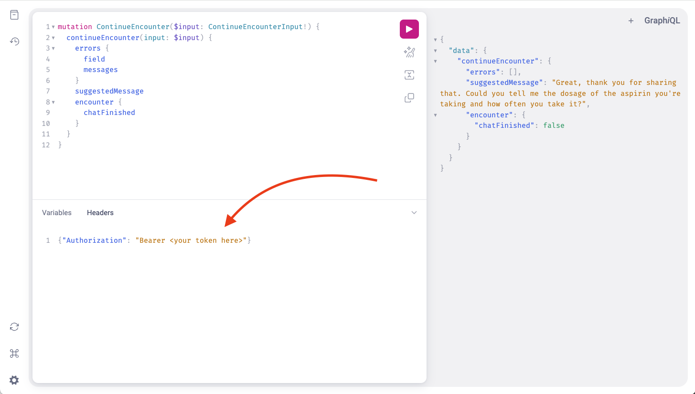
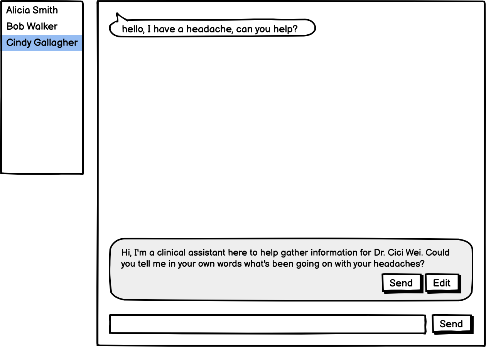
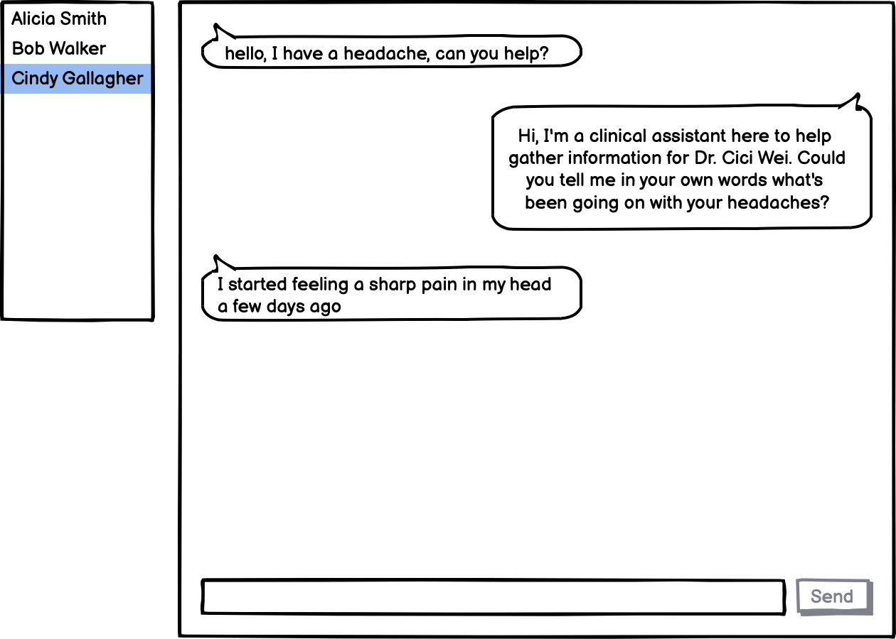

# Perceptive API

All interaction with our service is based on a [GraphQL](https://graphql.org/) API. GraphQL is a widely adopted moredn technology - for example [GitHub has a GraphQL API](https://docs.github.com/en/graphql/overview/explorer). Our own API is available at [https://perceptive.app/graphql/](https://perceptive.app/graphql/).

There you can find a GUI explorer (the exact same one used by GitHub). **Important** - to make a request, you have to specify your token in the "HEADERS" section of the explorer:



To get the access token, contact your Perceptive representative.


## Chat integration

The public API is designed to enable two possible workflows:
1. Human in the loop (suggestions)
2. Autonomous assistant


### Human in the loop (suggestions)

In this scenario, we're providing suggestions to a human agent, who can then choose to send them to the patient, edit them, or send something entirely different.



To implement this, you'll need to:
1. Set up a new encounter with [createEncounter mutation](#create-encounter)
2. Call [continueEncounter mutation](#continue-encounter), which will return a suggestion for the next message
   * Note that you need to provide the entire conversation history every time you call this API, not just the new messages.
3. Show the suggestion to the human agent, allow them to send whatever they end up sending, and wait for the patient's response
4. Repeat from step 2, until `continueEncounter` returns `encounter.chatFinished` flag.
5. [Poll the encounter](#get-encounter-summary) until status equals `REPORT_GENERATED`, and get the summary


### Autonomous assistant

In this scenario, the bot is fully autonomous, and can send messages to the patient without human intervention.



This workflow uses the same APIs but in a simpler way:
1. Set up a new encounter with [createEncounter mutation](#create-encounter)
2. Call [continueEncounter mutation](#continue-encounter), which will return a suggestion for the next message
   * Note that you need to provide the entire conversation history every time you call this API, not just the new messages.
3. Immediately send the suggestion to the patient and wait for the patient's response
4. Repeat from step 2, until `continueEncounter` returns `encounter.chatFinished` flag.
5. [Poll the encounter](#get-encounter-summary) until status equals `REPORT_GENERATED`, and get the summary

### Caveats

* If the discussion with the patient continues in the same thread for multiple separated encounters, the API user is responsible for separating them.
* Streaming message suggestions is currently not supported.
* The end of the encounter is not indicated in the API right now.


## API Examples

Here are a few examples of how to use the API to ember our assistant into your chat platform.

It's not a comprehensive description of the API, if you want a complete description of all the available mutations and fields, that can be found in the [API explorer](https://perceptive.care/graphql/).

### Create encounter

Here's where we set the context of the conversation for the bot - who the patient is, what to discuss, etc.

The mutation is called `createEncounter`:
```graphql
mutation CreateEncounter($input: CreateEncounterInput!) {
  createEncounter(input: $input) {
    encounter {
      id
    }
    errors {
      field
      messages
    }
  }
}

# Variables:
# {
#   "input": {
#     "newPatient": {
#       "name": "Alicia Smith",
#       "birthDate": "1998-01-05",
#       "gender": "FEMALE"
#     }
#   }
# }
```

Here's an example response:
```json
{
  "data": {
    "createEncounter": {
      "encounter": {
        "id": "<your encounter id here>"
      },
      "errors": []
    }
  }
}
```

[Try it in the explorer](https://perceptive.care/graphql/#query=%23%20Don't%20forget%20the%20Authorization%20header%0A%0Amutation%20CreateEncounter(%24input%3A%20CreateEncounterInput!)%20%7B%0A%20%20createEncounter(input%3A%20%24input)%20%7B%0A%20%20%20%20encounter%20%7B%0A%20%20%20%20%20%20id%0A%20%20%20%20%7D%0A%20%20%20%20errors%20%7B%0A%20%20%20%20%20%20field%0A%20%20%20%20%20%20messages%0A%20%20%20%20%7D%0A%20%20%7D%0A%7D%0A&operationName=CreateEncounter&variables=%7B%0A%20%20%22input%22%3A%20%7B%0A%20%20%20%20%22newPatient%22%3A%20%7B%0A%20%20%20%20%20%20%22name%22%3A%20%22Alicia%20Smith%22%2C%0A%20%20%20%20%20%20%22birthDate%22%3A%20%221998-01-05%22%2C%0A%20%20%20%20%20%20%22gender%22%3A%20%22FEMALE%22%0A%20%20%20%20%7D%0A%20%20%7D%0A%7D)


### Continue encounter

Use this mutation to update the conversation with new messages and get a suggestion for the next message.

```graphql
mutation ContinueEncounter($input: ContinueEncounterInput!) {
  continueEncounter(input: $input) {
    suggestedMessage
    encounter {
      chatFinished
    }
    errors {
      field
      messages
    }
  }
}

# Variables:
# {
#   "input": {
#     "encounter": "<your encounter id here>",
#     "messages": [
#       {"role": "USER", "content": "hello, I have a headache, can you help?"},
#       {"role": "ASSISTANT", "content": "Hello Alicia, I'm Sam, tell me about your headache please."},
#       {"role": "USER", "content": "I started feeling a sharp pain in my head a few days ago"}
#     ]
#   }
# }
```

Example response:
```json
{
  "data": {
    "continueEncounterExternal": {
      "suggestedMessage": "Hi, I'm a clinical assistant here to help gather information for Dr. Johnson. Could you tell me in your own words what's been going on with your headaches?",
      "encounter": {
        "chatFinished": false
      },
      "errors": []
    }
  }
}
```

[Try it in the explorer](https://perceptive.care/graphql/#query=%23%20Don't%20forget%20the%20Authorization%20header%0A%0Amutation%20ContinueEncounter(%24input%3A%20ContinueEncounterInput!)%20%7B%0A%20%20continueEncounter(input%3A%20%24input)%20%7B%0A%20%20%20%20suggestedMessage%0A%20%20%20%20encounter%20%7B%0A%20%20%20%20%20%20chatFinished%0A%20%20%20%20%7D%0A%20%20%20%20errors%20%7B%0A%20%20%20%20%20%20field%0A%20%20%20%20%20%20messages%0A%20%20%20%20%7D%0A%20%20%7D%0A%7D%0A%0A&operationName=ContinueEncounter&variables=%7B%0A%20%20%22input%22%3A%20%7B%0A%20%20%20%20%22encounter%22%3A%20%22%3Cyour%20encounter%20id%20here%3E%22%2C%0A%20%20%20%20%22messages%22%3A%20%5B%0A%20%20%20%20%20%20%7B%22role%22%3A%20%22USER%22%2C%20%22content%22%3A%20%22hello%2C%20I%20have%20a%20headache%2C%20can%20you%20help%3F%22%7D%0A%20%20%20%20%5D%0A%20%20%7D%0A%7D)


### Get encounter summary

Get a text summary or a PDF summary after the encounter has ended.

```graphql
query EncounterSummary($encounterId: ID!) {
  node(id: $encounterId) {
    ... on EncounterType {
      status
      outcome {
        summaryText
        summaryDownloadUrl
      }
    }
  }
}

# Variables:
# {
#   "encounterId": "<your encounter id here>"
# }
```

Example response:
```json
{
  "data": {
    "node": {
      "status": "REPORT_GENERATED",
      "outcome": {
        "summaryText": "- Patient Details: Sam Smith, 25 years old, male\n- The patient is currently not taking any medications or supplements.\n- The patient has a known allergy to fish, resulting in hives and difficulty breathing upon exposure. He reports no other known allergies, including to latex.\n- The patient presents with a headache, described as sharp, over the last 2-3 days. The pain intensity is rated as 7 on a scale of 1 to 10 and is primarily localized at the back of his head.\n- The patient has taken aspirin for the headache without relief. No concurrent symptoms such as nausea, vomiting, dizziness, vertigo, light or sound sensitivity, or blurry vision have been reported.\n- The patient does not experience auras or prodrome symptoms associated with the headache.\n- There is a documented family history of migraines, with the patient's mother being a known migraine sufferer.",
        "summaryDownloadUrl": "/encounters/con_jevoUhC5gfq4C4kh/report-pdf/"
      }
    }
  }
}
```

[Try it in the explorer](https://perceptive.care/graphql/#query=%23%20Don't%20forget%20the%20Authorization%20header%0A%0Amutation%20ContinueEncounter(%24input%3A%20ContinueEncounterInput!)%20%7B%0A%20%20continueEncounter(input%3A%20%24input)%20%7B%0A%20%20%20%20suggestedMessage%0A%20%20%20%20encounter%20%7B%0A%20%20%20%20%20%20chatFinished%0A%20%20%20%20%7D%0A%20%20%20%20errors%20%7B%0A%20%20%20%20%20%20field%0A%20%20%20%20%20%20messages%0A%20%20%20%20%7D%0A%20%20%7D%0A%7D%0A%0A&operationName=ContinueEncounter&variables=%7B%0A%20%20%22input%22%3A%20%7B%0A%20%20%20%20%22encounter%22%3A%20%22%3Cyour%20encounter%20id%20here%3E%22%2C%0A%20%20%20%20%22messages%22%3A%20%5B%0A%20%20%20%20%20%20%7B%22role%22%3A%20%22USER%22%2C%20%22content%22%3A%20%22hello%2C%20I%20have%20a%20headache%2C%20can%20you%20help%3F%22%7D%0A%20%20%20%20%5D%0A%20%20%7D%0A%7D)


